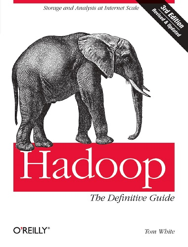

#### &#x1F4DA; [Back to Bookshelf](../)

  

## Introduction

Ready to unlock the power of your data? With this comprehensive guide, you’ll learn how to build and maintain reliable, scalable, distributed systems with Apache Hadoop. This book is ideal for programmers looking to analyze datasets of any size, and for administrators who want to set up and run Hadoop clusters.

You’ll find illuminating case studies that demonstrate how Hadoop is used to solve specific problems. This third edition covers recent changes to Hadoop, including material on the new MapReduce API, as well as MapReduce 2 and its more flexible execution model (YARN).
	- Store large datasets with the Hadoop Distributed File System (HDFS)
	- Run distributed computations with MapReduce
	- Use Hadoop’s data and I/O building blocks for compression, data integrity, serialization (including Avro), and persistence
	- Discover common pitfalls and advanced features for writing real-world MapReduce programs
	-Design, build, and administer a dedicated Hadoop cluster—or run Hadoop in the cloud
	-Load data from relational databases into HDFS, using Sqoop
	-Perform large-scale data processing with the Pig query language
	-Analyze datasets with Hive, Hadoop’s data warehousing system
	-Take advantage of HBase for structured and semi-structured data, and ZooKeeper for building distributed systems

## Contents

[Chapter 01: Meet Hadoop](./Ch01_Meet_Hadoop.md)

[Chapter 02: MapReduce](./Ch02_MapReduce.md)

[Chapter 03: The Hadoop Distributed Filesystem](./Ch03_The_Hadoop_Distributed_Filesystem.md)

[Chapter 04: Hadoop I/O](./Ch04_Hadoop_IO.md)

[Chapter 05: Developing a MapReduce Application](./Ch05_Developing_a_MapReduce_Application.md)

[Chapter 06: How MapReduce Works](./Ch06_How_MapReduce_Works.md)

[Chapter 07: MapReduce Types and Formats](./Ch07_MapReduce_Types_and_Formats.md)

[Chapter 08: MapReduce Features](./Ch08_MapReduce_Features.md)

[Chapter 09: Setting Up a Hadoop Cluster](./Ch09_Setting_Up_a_Hadoop_Cluster.md)

[Chapter 10: Administering Hadoop](./Ch10_Administering_Hadoop.md)

[Chapter 11: Pig](./Ch11_Pig.md)

[Chapter 12: Hive](./Ch12_Hive.md)

[Chapter 13: HBase](./Ch13_HBase.md)

[Chapter 14: ZooKeeper](./Ch14_ZooKeeper.md)

[Chapter 15: Sqoop](./Ch15_Sqoop.md)

[Chapter 16: Case Studies](./Ch16_Case_Studies.md)

#### &#x1F4DA; [Back to Bookshelf](../)