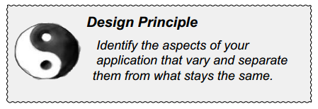
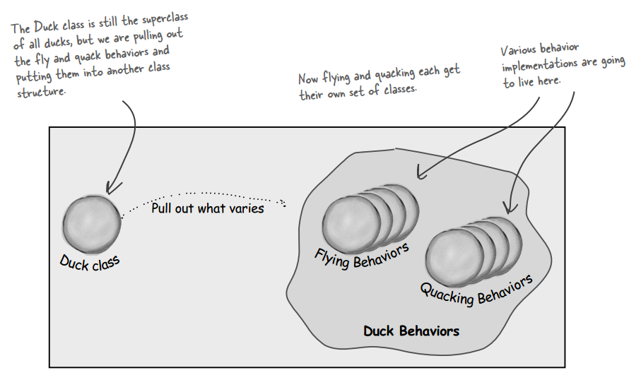
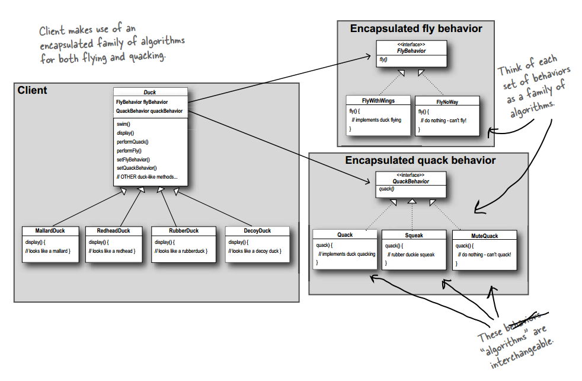

#### &#x1F4DA; [Bookshelf](../)
#### &#x1F4DC; [Contents](./README.md#contents)
#### &#x1F449; [Next](./Ch02_the_Observer_Pattern.md)

## Chapter 01: Intro to Design Patterns

- design principle  
  

- Take what varies and “encapsulate” it so it won’t affect the rest of your code. The result? Fewer unintended consequences
from code changes and more flexibility in your systems!

- Separating what changes from what stays the same  
  

- design principle  
  

- “Program to an interface” really means “Program to a supertype.” The word interface is overloaded here. There’s the concept of interface, but there’s also the Java construct interface. You can program to an interface, without having to actually use a Java interface. The point is to exploit polymorphism by programming to a supertype so that the actual runtime object isn’t locked into the code. And we could rephrase “program to a supertype” as “the declared type of the variables should be a supertype, usually an abstract class or interface, so that the objects assigned to those variables can be of any concrete implementation of the supertype, which means the class declaring them doesn’t have to know about the actual object types!”

- encapsulated behaviors  
  

- design principle  
  

- The Strategy Pattern defines a family of algorithms, encapsulates each one, and makes them interchangeable. Strategy lets the algorithm vary independently from clients that use it.

- Remember, knowing concepts like abstraction, inheritance, and polymorphism do not make you a good object oriented designer. A design guru thinks about how to create flexible designs that are maintainable and that can cope with change.

- BULLET POINTS
	-Knowing the OO basics does not make you a good OO designer.
	- Good OO designs are reusable, extensible and maintainable.
	- Patterns show you how to build systems with good OO design qualities.
	- Patterns are proven objectoriented experience.
	- Patterns don’t give you code, they give you general solutions to design problems. You apply them to your specific application.
	- Patterns aren’t invented, they are discovered.
	- Most patterns and principles address issues of change in software.
	- Most patterns allow some part of a system to vary independently of all other parts.
	- We often try to take what varies in a system and encapsulate it.
	- Patterns provide a shared language that can maximize the value of your communication with other developers.

#### &#x1F4DA; [Bookshelf](../)
#### &#x1F4DC; [Contents](./README.md#contents)
#### &#x1F449; [Next](./Ch02_the_Observer_Pattern.md)