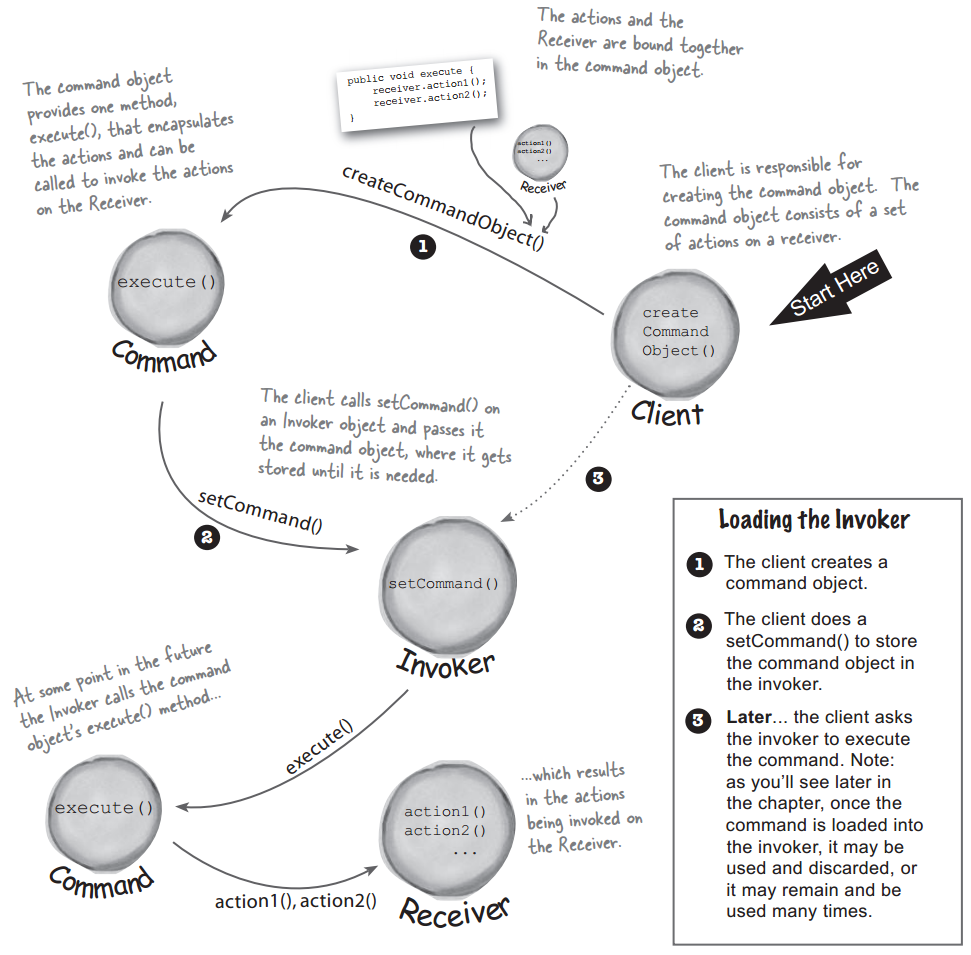
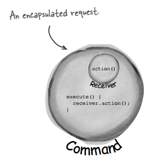
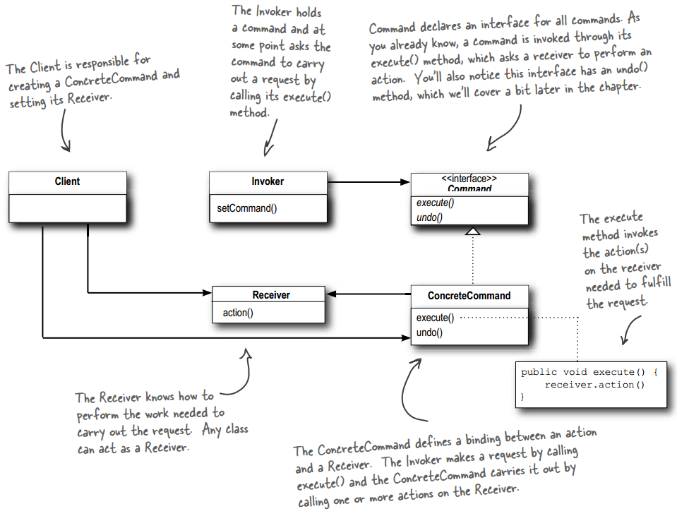
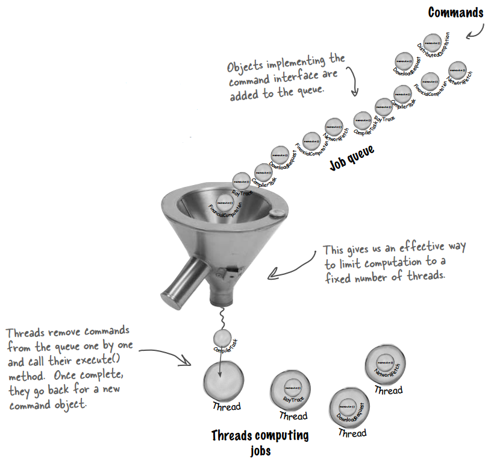

#### &#x1F4DA; [Bookshelf](../)
#### &#x1F4DC; [Contents](./README.md#contents)
#### &#x1F448; [Prev](./Ch05_the_Singleton_Pattern.md)
#### &#x1F449; [Next](./Ch07_the_Adapter_and_Facade_Patterns.md)

## Chapter 06: the Command Pattern

- command pattern  
  

- The Command Pattern encapsulates a request as an object, thereby letting you parameterize other objects with different requests, queue or log requests, and support undoable operations.

- encapsulated request  
  

- command pattern class diagram  
  

- A null object is useful when you don’t have a meaningful object to return, and yet you want to remove the responsibility for handling null from the client. You’ll find uses for Null Objects in conjunction with many Design Patterns and sometimes you’ll even see Null Object listed as a Design Pattern.

- Commands give us a way to package a piece of computation (a receiver and a set of actions) and pass it around as a first-class object. Now, the computation itself may be invoked long after some client application creates the command object. In fact, it may even be invoked by a different thread. We can take this scenario and apply it to many useful applications such as schedulers, thread pools and job queues, to name a few.

- job queues  
  

- The semantics of some applications require that we log all actions and be able to recover after a crash by reinvoking those actions. The Command Pattern can support these semantics with the addition of two methods: store() and load(). In Java we could use object serialization to implement these methods, but the normal caveats for using serialization for persistence apply. How does this work? As we execute commands, we store a history of them on disk. When a crash occurs, we reload the command objects and invoke their execute() methods in batch and in order. There are many applications that invoke actions on large data structures that can’t be quickly saved each time a change is made. By using logging, we can save all the operations since the last check point, and if there is a system failure, apply those operations to our checkpoint. In more advanced applications, these techniques can be extended to apply to sets of operations in a transactional manner so that all of the operations complete, or none of them do.

- BULLET POINTS
	- The Command Pattern decouples an object, making a request from the one that knows how to perform it.
	- A Command object is at the center of this decoupling and encapsulates a receiver with an action (or set of actions).
	- An invoker makes a request of a Command object by calling its execute() method, which invokes those actions on the receiver.
	- Invokers can be parameterized with Commands, even dynamically at runtime.
	- Commands may support undo by implementing an undo method that restores the object to its previous state before the execute() method was last called.
	- Macro Commands are a simple extension of Command that allow multiple commands to be invoked. Likewise, Macro Commands can easily support undo().
	- In practice, it is not uncommon for “smart” Command objects to implement the request themselves rather than delegating to a receiver.
	- Commands may also be used to implement logging and transactional systems.

#### &#x1F4DA; [Bookshelf](../)
#### &#x1F4DC; [Contents](./README.md#contents)
#### &#x1F448; [Prev](./Ch05_the_Singleton_Pattern.md)
#### &#x1F449; [Next](./Ch07_the_Adapter_and_Facade_Patterns.md)