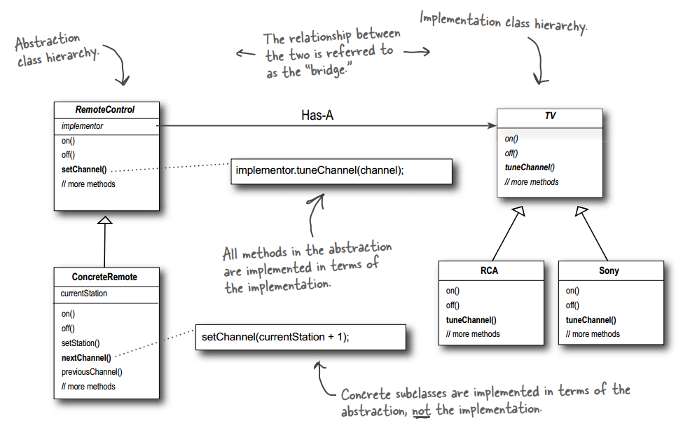
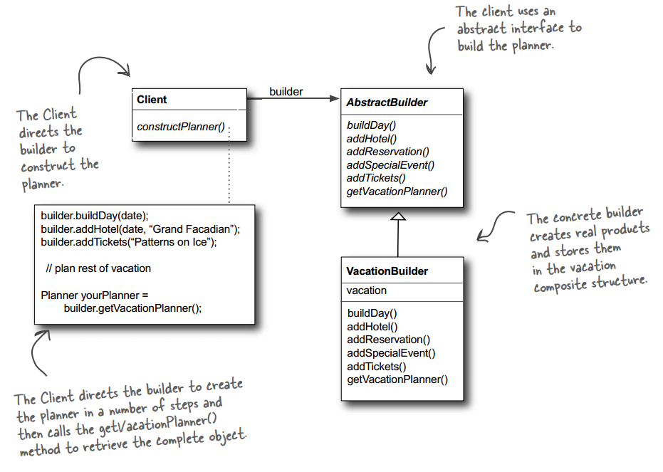
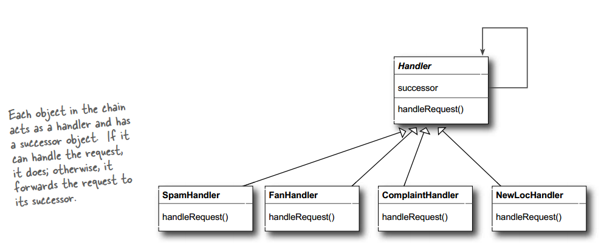
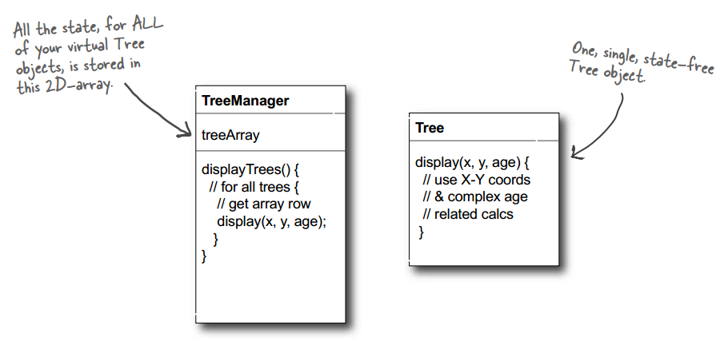
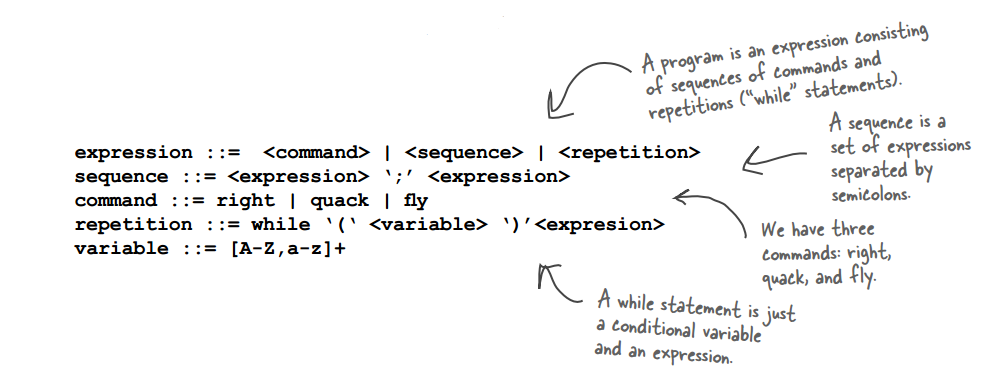
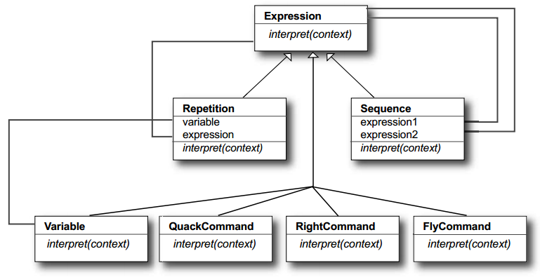
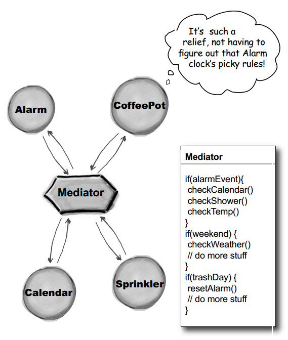
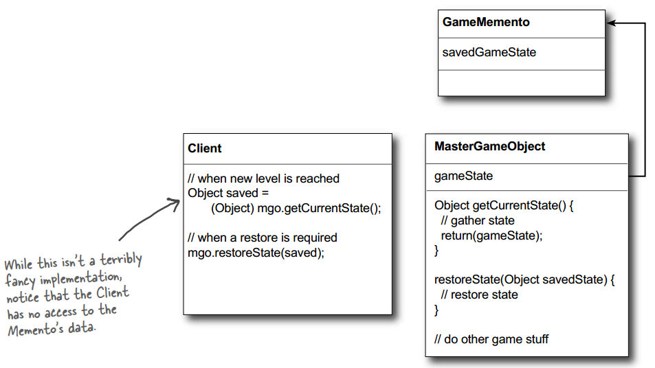
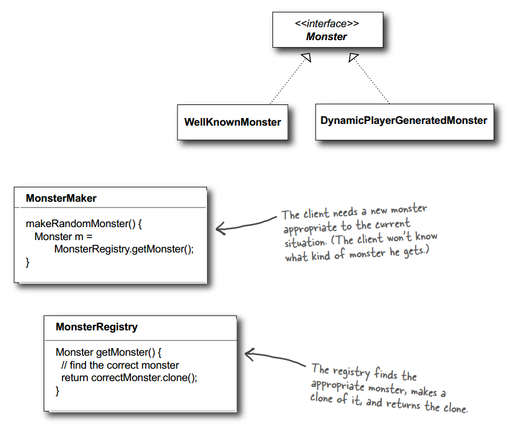
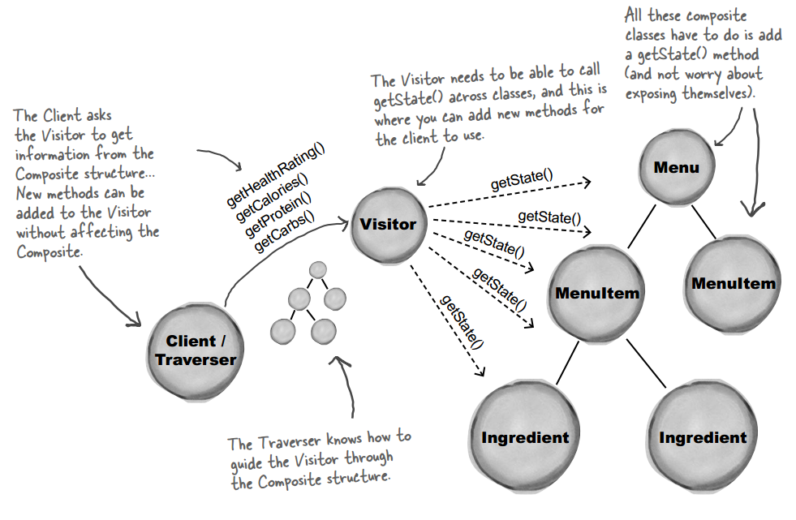

#### &#x1F4DA; [Bookshelf](../)
#### &#x1F4DC; [Contents](./README.md#contents)
#### &#x1F448; [Prev](./Ch13_Better_Living_with_Patterns.md)

## Chapter 14: Appendix

- Use the Bridge Pattern to vary not only your implementations, but also your abstractions. The Bridge Pattern allows you to vary the implementation and the abstraction by placing the two in separate class hierarchies.

- bridge pattern  
  

- Use the Builder Pattern to encapsulate the construction of a product and allow it to be constructed in steps.

- builder pattern  
  

- Use the Chain of Responsibility Pattern when you want to give more than one object a chance to handle a request. With the Chain of Responsibility Pattern, you create a chain of objects that examine a request. Each object in turn examines the request and handles it, or passes it on to the next object in the chain.

- chain of responsibility pattern  
  

- Use the Flyweight Pattern when one instance of a class can be used to provide many “virtual instances.”

- flyweight pattern  
  

- Use the Interpreter Pattern to build an interpreter for a language.

- interpreter pattern  
  
  

- Use the Mediator Pattern to centralize complex communications and control between related objects. Before adding the Mediator, all of the appliance objects needed to know about each other... they were all tightly coupled. With the Mediator in place, the appliance objects are all completely decoupled from each other.

- Mediator pattern  
  

- Use the Memento Pattern when you need to be able to return an object to one of its previous states; for instance, if your user requests an “undo.”

- memento pattern  
  

- Use the Prototype Pattern when creating an instance of a given class is either expensive or complicated. The Prototype Pattern allows you to make new instances by copying existing instances. (In Java this typically means using the clone() method, or de-serialization when you need deep copies.) A key aspect of this pattern is that the client code can make new instances without knowing which specifi c class is being instantiated.

- prototype pattern  
  

- Use the Visitor Pattern when you want to add capabilities to a composite of objects and encapsulation is not important.

- visitor pattern  
  

#### &#x1F4DA; [Bookshelf](../)
#### &#x1F4DC; [Contents](./README.md#contents)
#### &#x1F448; [Prev](./Ch13_Better_Living_with_Patterns.md)