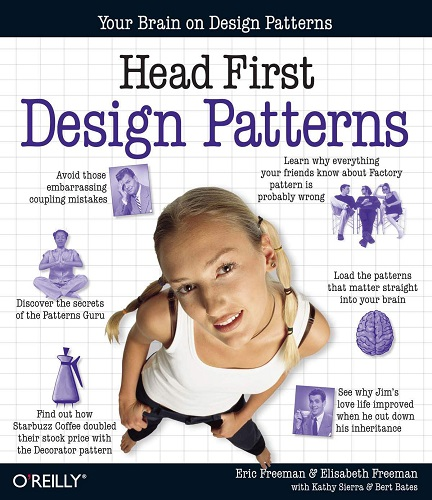

#### &#x1F4DA; [Back to Bookshelf](../)

  

## Introduction

**What’s so special about design patterns?**

At any given moment, someone struggles with the same software design problems you have. And, chances are, someone else has already solved your problem. This edition of Head First Design Patterns—now updated for Java 8—shows you the tried-and-true, road-tested patterns used by developers to create functional, elegant, reusable, and flexible software. By the time you finish this book, you’ll be able to take advantage of the best design practices and experiences of those who have fought the beast of software design and triumphed.

**What’s so special about this book?**

We think your time is too valuable to spend struggling with new concepts. Using the latest research in cognitive science and learning theory to craft a multi-sensory learning experience, Head First Design Patterns uses a visually rich format designed for the way your brain works, not a text-heavy approach that puts you to sleep.

## Contents

[Chapter 01: Intro to Design Patterns](./Ch01_Intro_to_Design_Patterns.md)

[Chapter 02: the Observer Pattern](./Ch02_the_Observer_Pattern.md)

[Chapter 03: the Decorator Pattern](./Ch03_the_Decorator_Pattern.md)

[Chapter 04: the Factory Pattern](./Ch04_the_Factory_Pattern.md)

[Chapter 05: the Singleton Pattern](./Ch05_the_Singleton_Pattern.md)

[Chapter 06: the Command Pattern](./Ch06_the_Command_Pattern.md)

[Chapter 07: the Adapter and Facade Patterns](./Ch07_the_Adapter_and_Facade_Patterns.md)

[Chapter 08: the Template Method Pattern](./Ch08_the_Template_Method_Pattern.md)

[Chapter 09: the Iterator and Composite Patterns](./Ch09_the_Iterator and_Composite_Patterns.md)

[Chapter 10: the State Pattern](./Ch10_the_State_Pattern.md)

[Chapter 11: the Proxy Pattern](./Ch11_the_Proxy_Pattern.md)

[Chapter 12: Compound Patterns](./Ch12_Compound_Patterns.md)

[Chapter 13: Better Living with Patterns](./Ch13_Better_Living_with_Patterns.md)

[Chapter 14: Appendix](./Ch14_Appendix.md)

#### &#x1F4DA; [Back to Bookshelf](../)