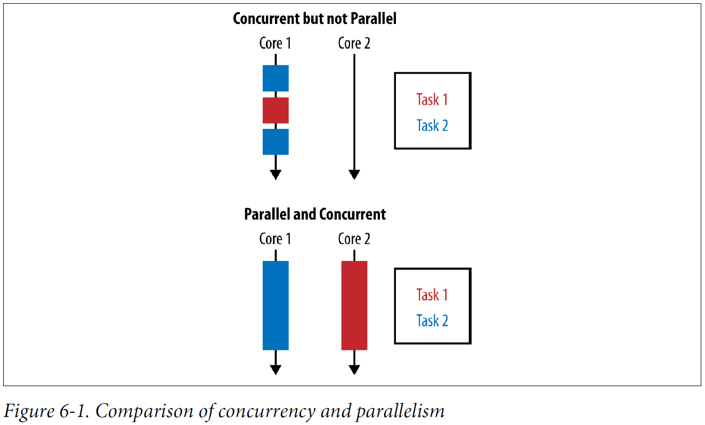
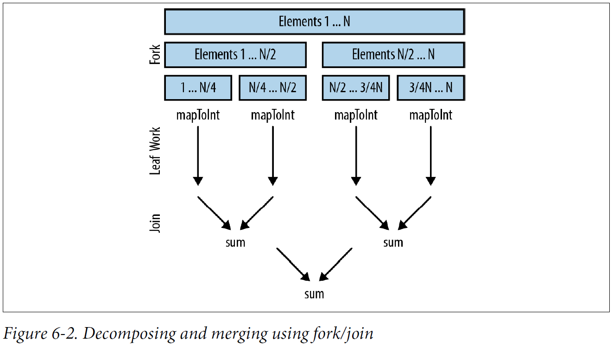

#### &#x1F4DA; [Bookshelf](../)
#### &#x1F4DC; [Contents](./README.md#contents)
#### &#x1F448; [Prev](./Ch05_Advanced_Collections_and_Collectors.md)
#### &#x1F449; [Next](./Ch07_Testing_Debugging_and_Refactoring.md)

## Chapter 06: Data Parallelism

- Concurrency arises when two tasks are making progress at overlapping time periods. Parallelism arises when two tasks are happening at literally the same time, such as on a multicore CPU.

	The goal of parallelism is to reduce the runtime of a specific task by breaking it down into smaller components and performing them in parallel.

	In data parallelism, we achieve parallelism by splitting up the data to be operated on and assigning a single processing unit to each chunk of data.

	Data parallelism works really well when you want to perform the same operation on a lot of data. The problem needs be decomposed in a way that will work on subsections of the data, and then the answers from each subsection can be composed at the end.

	Data parallelism is often contrasted with task parallelism, in which each individual thread of execution can be doing a totally different task.

- Comparison of concurrency and parallelism  
  

- Amdahl’s Law is a simple rule that predicts the theoretical maximum speedup of a program on a machine with multiple cores. If we take a program that is entirely serial and parallelize only half of it, then the maximum speedup possible, regardless of how many cores we throw at the problem, is 2×.

- Making an operation execute in parallel using the streams library is a matter of changing a single method call. If you already have a Stream object, then you can call its parallel method in order to make it parallel. If you’re creating a Stream from a Collection, you can call the parallelStream method in order to create a parallel stream from the get-go.

- Parallel summing of album track lengths
  ```java
  public int parallelArraySum() {
    return albums.parallelStream()
                 .flatMap(Album::getTracks)
                 .mapToInt(Track::getLength)
                 .sum();
  }
  ```

- Parallel Monte Carlo simulation of dice rolling
  ```java
  public Map<Integer, Double> parallelDiceRolls() {
    double fraction = 1.0 / N;
    return IntStream.range(0, N)
                    .parallel()
                    .mapToObj(twoDiceThrows())
                    .collect(groupingBy(side -> side, summingDouble(n -> fraction)));
  }
  ```

- Previously, when calling reduce our initial element could be any value, but for this operation to work correctly in parallel, it needs to be the identity value of the combining function. The identity value leaves all other elements the same when reduced with them.

	The other caveat specific to reduce is that the combining function must be associative. This means that the order in which the combining function is applied doesn’t matter as long the values of the sequence aren’t changed.

	One thing to avoid is trying to hold locks. The streams framework deals with any necessary synchronization itself, so there’s no need to lock your data structures.

- There are five important factors that influence parallel streams performance that we’ll be looking at:
	- **Data size** There is a difference in the efficiency of the parallel speedup due to the size of the input data. There’s an overhead to decomposing the problem to be executed in parallel and merging the results. This makes it worth doing only when there’s enough data that execution of a streams pipeline takes a while.
	- **Source data structure** Each pipeline of operations operates on some initial data source; this is usually a collection. It’s easier to split out subsections of different data sources, and this cost affects how much parallel speedup you can get when executing your pipeline.
	- **Packing** Primitives are faster to operate on than boxed values.
	- **Number of cores** The extreme case here is that you have only a single core available to operate upon, so it’s not worth going parallel. Obviously, the more cores you have access to, the greater your potential speedup is. In practice, what counts isn’t just the number of cores allocated to your machine; it’s the number of cores that are available for your machine to use at runtime. This means factors such as other processes executing simultaneously or thread affinity (forcing threads to execute on certain cores or CPUs) will affect performance.
	- **Cost per element** Like data size, this is part of the battle between time spent executing in parallel and overhead of decomposition and merging. The more time spent operating on each element in the stream, the better performance you’ll get from going parallel.

- Parallel integer addition
  ```java
  private int addIntegers(List<Integer> values) {
    return values.parallelStream()
                 .mapToInt(i -> i)
                 .sum();
  }
  ```

	Under the hood, parallel streams back onto the fork/join framework. The fork stage recursively splits up a problem. Then each chunk is operated upon in parallel. Finally, the join stage merges the results back together.

- Decomposing and merging using fork/join  
  

- We can split up common data sources from the core library into three main groups by performance characteristics:
	- **The good** An ArrayList, an array, or the IntStream.range constructor. These data sources all support random access, which means they can be split up arbitrarily with ease.
	- **The okay** The HashSet and TreeSet. You can’t easily decompose these with perfect amounts of balance, but most of the time it’s possible to do so.
	- **The bad** Some data structures just don’t split well; for example, they may take O(N) time to decompose. Examples here include a LinkedList, which is computationally hard to split in half. Also, Streams.iterate and BufferedReader.lines have unknown length at the beginning, so it’s pretty hard to estimate when to split these sources.

- When we’re talking about the kinds of operations in our stream pipeline that let us operate on chunks individually, we can differentiate between two types of stream operations: stateless and stateful. Stateless operations need to maintain no concept of state over the whole operation; stateful operations have the overhead and constraint of maintaining state.

- Java 8 includes a couple of other parallel array operations that utilize lambda expressions outside of the streams framework. Like the operations on the streams framework, these are data parallel operations.

- Initializing an array using a parallel array operation
  ```java
  public static double[] parallelInitialize(int size) {
    double[] values = new double[size];
    Arrays.parallelSetAll(values, i -> i);
    return values;
  }
  ```

- Calculating a simple moving average
  ```java
  public static double[] simpleMovingAverage(double[] values, int n) {
    double[] sums = Arrays.copyOf(values, values.length);
    Arrays.parallelPrefix(sums, Double::sum);
    int start = n - 1;
    return IntStream.range(start, sums.length)
                    .mapToDouble(i -> {
                        double prefix = i == start ? 0 : sums[i - n];
                        return (sums[i] - prefix) / n;
                    })
                    .toArray();
  }
  ```

#### &#x1F4DA; [Bookshelf](../)
#### &#x1F4DC; [Contents](./README.md#contents)
#### &#x1F448; [Prev](./Ch05_Advanced_Collections_and_Collectors.md)
#### &#x1F449; [Next](./Ch07_Testing_Debugging_and_Refactoring.md)