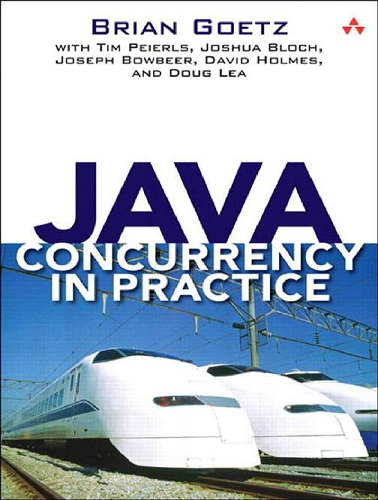

#### &#x1F4DA; [Back to Bookshelf](../)

  

## Introduction

Threads are a fundamental part of the Java platform. As multicore processors become the norm, using concurrency effectively becomes essential for building high-performance applications. Java SE 5 and 6 are a huge step forward for the development of concurrent applications, with improvements to the Java Virtual Machine to support high-performance, highly scalable concurrent classes and a rich set of new concurrency building blocks. In **Java Concurrency in Practice** , the creators of these new facilities explain not only how they work and how to use them, but also the motivation and design patterns behind them.

However, developing, testing, and debugging multithreaded programs can still be very difficult; it is all too easy to create concurrent programs that appear to work, but fail when it matters most: in production, under heavy load. **Java Concurrency in Practice** arms readers with both the theoretical underpinnings and concrete techniques for building reliable, scalable, maintainable concurrent applications. Rather than simply offering an inventory of concurrency APIs and mechanisms, it provides design rules, patterns, and mental models that make it easier to build concurrent programs that are both correct and performant.

This book covers:
- Basic concepts of concurrency and thread safety
- Techniques for building and composing thread-safe classes
- Using the concurrency building blocks in java.util.concurrent
- Performance optimization dos and don'ts
- Testing concurrent programs
- Advanced topics such as atomic variables, nonblocking algorithms, and the Java Memory Model

## Contents

[Chapter 01: Introduction](./Ch01_Introduction.md)

[Chapter 02: Thread Safety](./Ch02_Thread_Safety.md)

[Chapter 03: Sharing Objects](./Ch03_Sharing_Objects.md)

[Chapter 04: Composing Objects](./Ch04_Composing_Objects.md)

[Chapter 05: Building Blocks](./Ch05_Building_Blocks.md)

[Chapter 06: Task Execution](./Ch06_Task_Execution.md)

[Chapter 07: Cancellation and Shutdown](./Ch07_Cancellation_and_Shutdown.md)

[Chapter 08: Applying Thread Pools](./Ch08_Applying_Thread_Pools.md)

[Chapter 09: GUI Applications](./Ch09_GUI_Applications.md)

[Chapter 10: Avoiding Liveness Hazards](./Ch10_Avoiding_Liveness_Hazards.md)

[Chapter 11: Performance and Scalability](./Ch11_Performance_and_Scalability.md)

[Chapter 12: Testing Concurrent Programs](./Ch12_Testing_Concurrent_Programs.md)

[Chapter 13: Explicit Locks](./Ch13_Explicit_Locks.md)

[Chapter 14: Building Custom Synchronizers](./Ch14_Building_Custom_Synchronizers.md)

[Chapter 15: Atomic Variables and Nonblocking Synchronization](./Ch15_Atomic_Variables_and_Nonblocking_Synchronization.md)

[Chapter 16: The Java Memory Model](./Ch16_The_Java_Memory_Model.md)

#### &#x1F4DA; [Back to Bookshelf](../)