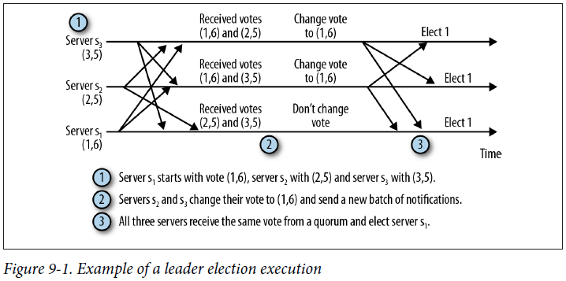
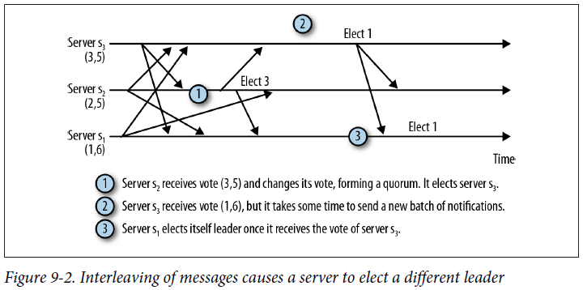
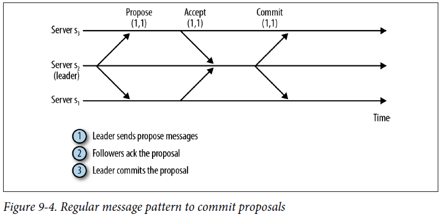

#### &#x1F4DA; [Bookshelf](../)
#### &#x1F4DC; [Contents](./README.md#contents)
#### &#x1F448; [Prev](./Ch08_Curator_A_High_Level_API_for_ZooKeeper.md)
#### &#x1F449; [Next](./Ch10_Running_ZooKeeper.md)

## Chapter 09: ZooKeeper Internals

- ZooKeeper servers process read requests (exists, getData, and getChildren) locally.

Client requests that change the state of ZooKeeper (create, delete, and setData) are forwarded to the leader. The leader executes the request, producing a state update that we call a transaction.

- The groups that elect and support a leader must intersect on at least one server process. We use the term quorum to denote such subsets of processes. Quorums pairwise intersect.

	The leader election messages are called leader election notifications, or simply notifications. The protocol is extremely simple. When a server enters the LOOKING state, it sends a batch of notification messages, one to each of the other servers in the ensemble. The message contains its current vote, which consists of the server’s identifier (sid) and the zxid (zxid) of the most recent transaction it executed.

	Upon receiving a vote, a server changes its vote according to the following rules:
	- (1) Let voteId and voteZxid be the identifier and the zxid in the current vote of the receiver, whereas myZxid and mySid are the values of the receiver itself.
	- (2) If (voteZxid > myZxid) or (voteZxid = myZxid and voteId > mySid), keep the current vote.
	- (3) Otherwise, change my vote by assigning myZxid to voteZxid and mySid to vote Zxid.

	In short, the server that is most up to date wins, because it has the most recent zxid.

- Example of a leader election execution  
  

- Interleaving of messages causes a server to elect a different leader  
  

- The current implementation of FastLeaderElection, the default leader election implementation, uses a fixed value of 200 ms (see the constant finalizeWait). This value is longer than the expected message delay in modern data centers (less than a millisecond to a few milliseconds), but not long enough to make a substantial difference to recovery time. In case this delay (or any other chosen delay) is not sufficiently long, one or more servers will end up falsely electing a leader that does not have enough followers, so the servers will have to go back to leader election. Falsely electing a leader might make the overall recovery time longer because servers will connect and sync unnecessarily, and still need to send more messages to elect another leader.

- Upon receiving a write request, a follower forwards it to the leader. The leader executes the request speculatively and broadcasts the result of the execution as a state update, in the form of a transaction. A transaction comprises the exact set of changes that a server must apply to the data tree when the transaction is committed. The data tree is the data structure holding the ZooKeeper state (see DataTree).

	The next question to answer is how a server determines that a transaction has been committed. This follows a protocol called Zab: the ZooKeeper Atomic Broadcast protocol. Assuming that there is an active leader and it has a quorum of followers supporting its leadership, the protocol to commit a transaction is very simple, resembling a twophase commit:
	- (1) The leader sends a PROPOSAL message, p, to all followers.
	- (2) Upon receiving p, a follower responds to the leader with an ACK, informing the leader that it has accepted the proposal.
	- (3) Upon receiving acknowledgments from a quorum (the quorum includes the leader itself), the leader sends a message informing the followers to COMMIT it.

	Before acknowledging a proposal, the follower needs to perform a couple of additional checks. The follower needs to check that the proposal is from the leader it is currently following, and that it is acknowledging proposals and committing transactions in the same order that the leader broadcasts them in.

- Regular message pattern to commit proposals  
  

- Pipeline of a standalone server  
  

	PrepRequestProcessor accepts a client request and executes it, generating a transaction as a result.

	The next request processor is SyncRequestProcessor. SyncRequestProcessor is responsible for persisting transactions to disk.

	The next and final processor is FinalRequestProcessor. It applies changes to the ZooKeeper data tree when the Request object contains a transaction. Otherwise, this processor reads the data tree and returns to the client.

- Pipeline of a leader server  
  

	The first processor is still PrepRequestProcessor, but the following processor now becomes ProposalRequestProcessor. It prepares proposals and sends them to the followers. ProposalRequestProcessor forwards all requests to CommitRequestProces sor, and additionally forwards the write requests to SyncRequestProcessor.

	SyncRequestProcessor works the same as it does for the standalone server, and persists transactions to disk. It ends by triggering AckRequestProcessor, a simple request processor that generates an acknowledgment back to itself.

	The other processor following ProposalRequestProcessor is CommitRequestProces sor. CommitRequestProcessor commits proposals that have received enough acknowledgments.

	The next and final processor is FinalRequestProcessor, which is the same as the one used for the standalone server. FinalRequestProcessor applies update requests and executes read requests. Before FinalRequestProcessor, there stands a simple request processor that removes elements of a list of proposals to be applied. This request processor is called ToBeAppliedRequestProcessor. The list of to-be-applied requests contains requests that have been acknowledged by a quorum and are waiting to be applied. The leader uses this list to synchronize with followers and adds to this list when processing acknowledgments.

- Pipeline of a follower server  
  

	We start with FollowerRequestProcessor, which receives and processes client requests. FollowerRequestProcessor forwards requests to CommitRequestProcessor, additionally forwarding write requests to the leader. CommitRequestProcessor forwards read requests directly to FinalRequestProcessor, whereas for write requests, CommitRequestProcessor must wait for a commit before forwarding to FinalRequest Processor.

	When the leader receives a new write request, directly or through a learner, it generates a proposal and forwards it to followers. Upon receiving a proposal, a follower sends it to SyncRequestProcessor. SyncRequestProcessor processes the request, logging it to disk, and forwards it to SendAckRequestProcessor. SendAckRequestProcessor acknowledges the proposal to the leader. After the leader receives enough acknowledgments to commit a proposal, the leader sends commit messages to the followers (and sends INFORM messages to the observers). Upon receiving a commit message, a follower processes it with CommitRequestProcessor.

- Because writing to the transaction log is in the critical path of write requests, ZooKeeper needs to be efficient about it. Appending to the file can be done efficiently on hard drives, but there are a couple of other tricks ZooKeeper uses to make it fast: group commits and padding. Group commits consist of appending multiple transactions in a single write to the disk. This allows many transactions to be persisted at the cost of a single disk seek.

	There is one important caveat about persisting transactions to disk. Modern operating systems typically cache dirty pages and write them asynchronously to disk media. However, we need to make sure that transactions have been persisted before we move on. We consequently need to flush transactions onto disk media. Flushing here simply means that we tell the operating system to write dirty pages to disk and return when the operation completes.

	Padding consists of preallocating disk blocks to a file. This is done so that updates to the file system metadata for block allocation do not significantly affect sequential writes to the file. This would induce at least two extra disk seeks: one to update the metadata and another back to the file.

- Snapshots are copies of the ZooKeeper data tree. Each server frequently takes a snapshot of the data tree by serializing the whole data tree and writing it to a file.

- As we noted earlier, transactions are idempotent, so as long as we apply the same transactions in the same order, we will get the same result even if some of them have already been applied to the snapshot.

- Such problems with reapplying requests are taken care of by turning transactions into state deltas generated by the leader. When the leader generates a transaction for a given request, as part of generating the transaction, it includes the changes in the request to the znode or its data and specifies a fixed version number. Reapplying a transaction consequently does not induce inconsistent version numbers.

- Watches are tracked only in memory. They are never persisted to the disk. When a client disconnects from a server, all its watches are removed from memory. Because client libraries also keep track of their outstanding watches, they will reestablish any outstanding watches on the new server that they connect with.

- For the serialization of messages and transactions to send over the network and to store on disk, ZooKeeper uses Jute, which grew out of Hadoop.

	The main definition file for Jute is zookeeper.jute. It contains all definitions of messages and file records. Here is an example of a Jute definition we have in this file:
  ```java
  module org.apache.zookeeper.txn {
  ...
    class CreateTxn {
      ustring path;
      buffer data;
      vector<org.apache.zookeeper.data.ACL> acl;
      boolean ephemeral;
      int parentCVersion;
    }
  ...
  }
  ```

#### &#x1F4DA; [Bookshelf](../)
#### &#x1F4DC; [Contents](./README.md#contents)
#### &#x1F448; [Prev](./Ch08_Curator_A_High_Level_API_for_ZooKeeper.md)
#### &#x1F449; [Next](./Ch10_Running_ZooKeeper.md)