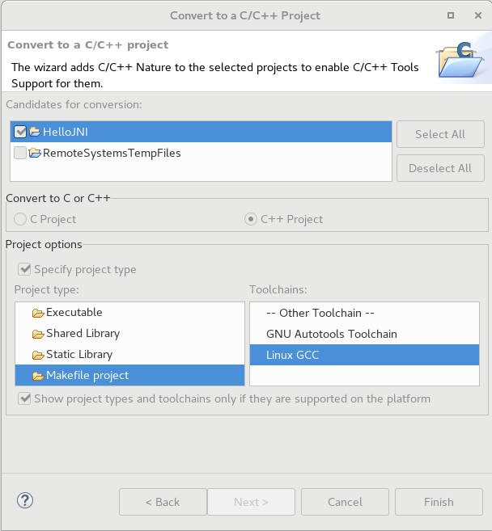
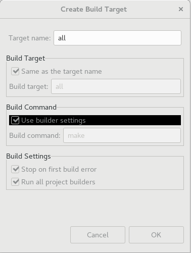
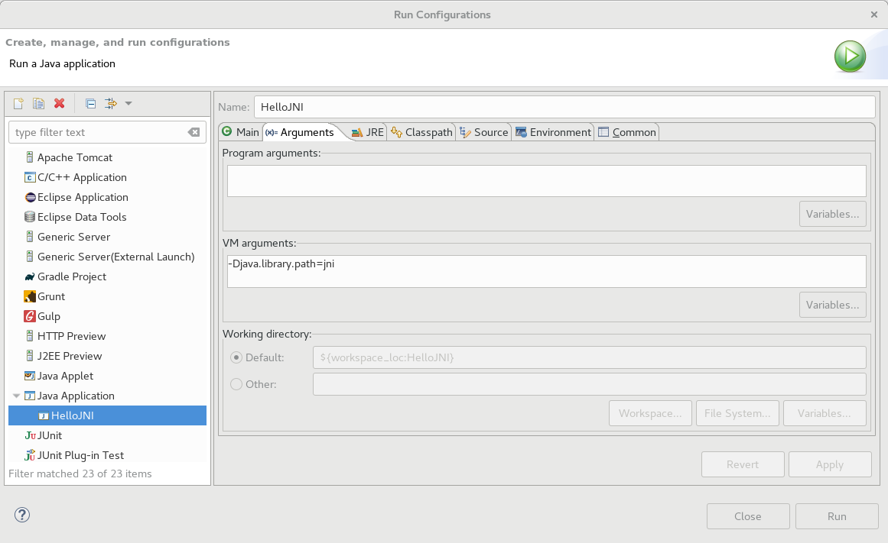

#### &#x1F4DA; [Posts](../)

## Eclipse 在单个项目下利用 CDT 进行 JNI 开发

目标：我们希望在单个项目下同时进行 C/C++ 和 JNI 开发。

- 创建 Java 项目 (HelloJNI),并创建 Java 类。
  ```java
  public class HelloJNI {
      static {
          System.loadLibrary("hello");
      }

      private native void sayHello();

      public static void main(String[] args) {
          new HelloJNI().sayHello();
      }
  }
  ```

	根据 shared libraries 的命名规约，每一个 shared library 的 soname 的构成为："lib 前缀 + library 名称 + .so"，因此，在 Linux 系统中，这段代码实际查找的是 libhello.so。

- 接着，将项目转换成 C/C++ 项目。New -> Other -> Convert to a C/C++ Project (Adds C/C++ Nature)，其中 Project type 选择 Makefile project，Toolchains 选择 Linux GCC，如下图。

	  

- 在项目下创建 jni 文件夹，用于存放 C/C++ 代码，我们在其中创建与 Java 类同名的 C/C++ 文件。
  ```c
  #include <jni.h>
  #include <stdio.h>
  #include "HelloJNI.h"

  JNIEXPORT void JNICALL Java_HelloJNI_sayHello(JNIEnv *env, jobject thisObj)
  {
     printf("Hello World!\n");
     return;
  }
  ```

- 在 jni 文件夹下创建 Makefile 文件。
  ```Makefile
  # Define a variable for classpath
  CLASS_PATH = ../bin

  # Define a virtual path for .class in the bin directory
  vpath %.class $(CLASS_PATH)

  all : libhello.so

  # $@ matches the target, $< matches the first dependancy
  libhello.so : HelloJNI.o
      gcc -Wextra -shared $< -o $@

  HelloJNI.o : HelloJNI.c HelloJNI.h
      gcc -fPIC -I/usr/lib/jvm/java/include -I/usr/lib/jvm/java/include/linux -c $< -o $@

  # $* matches the target filename without the extension
  HelloJNI.h : HelloJNI.class
      javah -classpath $(CLASS_PATH) $*

  clean :
      rm libhello.so HelloJNI.o HelloJNI.h
  ```

	其中，javah 根据 .class 文件生成对应的 .h 头文件。本例中实际为
  ```bash
  javah -classpath ../bin HelloJNI
  ```

	该命令会生成相应的 HelloJNI.h 文件。

- 右击 jni 文件夹，Build Targets -> Create...，在 Target name 处填写 all ，如下图。

	  

	Build该target后会在jni目录下生成libhello.so。

- 运行该 Java 项目，Run As -> Run Configurations，类型选择 Java Application，在 Arguments 面板下的 VM arguments 中填入library路径 -Djava.library.path=jni，如下图。

	  

- 可以在项目根目录下创建makefile文件，此时可省略前述 Create Build Targets 的步骤。
  ```
  all :
      cd jni; make

  clean :
      cd jni; make clean
  ```

### References

- 搬运自 [Eclipse for JNI development and debugging on Linux (Java and C)](https://developers.redhat.com/blog/2016/11/03/eclipse-for-jni-development-and-debugging-on-linux-java-and-c/)，原文更详尽，并提供了样例代码 [jniSnippets](https://github.com/LeoUfimtsev/jniSnippets)。

- [ECLIPSE CDT & JNI (JAVA NATIVE INTERFACE) WITH 64 BIT MINGW](http://www.bogotobogo.com/cplusplus/eclipse_CDT_JNI_MinGW_64bit.php) 提供了Windows的版本。

- [Shared Libraries](http://tldp.org/HOWTO/Program-Library-HOWTO/shared-libraries.html) 介绍了Shared Libraries的一些规约（如命名）。

- [The vpath Directive](https://www.gnu.org/software/make/manual/html_node/Selective-Search.html) 介绍了vpath（区别VPATH）。

- [Options to Request or Suppress Warnings](https://gcc.gnu.org/onlinedocs/gcc-4.5.1/gcc/Warning-Options.html) 介绍了-Wextra(-W)选项。

- [Build a shared library using GCC](http://www.microhowto.info/howto/build_a_shared_library_using_gcc.html) 介绍了-fPIC选项。

#### &#x1F4DA; [Posts](../)