#### &#x1F4DA; [Bookshelf](../)
#### &#x1F4DC; [Contents](./README.md#contents)
#### &#x1F448; [Prev](./Ch03_the_Decorator_Pattern.md)
#### &#x1F449; [Next](./Ch05_the_Singleton_Pattern.md)

## Chapter 04: the Factory Pattern

- Just another reminder: in design patterns, the phrase “implement an interface” does NOT always mean “write a class the implements a Java interface, by using the “implements” keyword in the class declaration.” In the general use of the phrase, a concrete class implementing a method from a supertype (which could be a class OR interface) is still considered to be “implementing the interface” of that supertype.

- A factory method handles object creation and encapsulates it in a subclass. This decouples the client code in the superclass from the object creation code in the subclass.

- factory pattern  
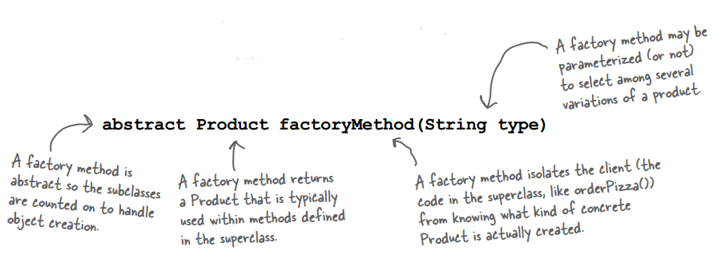  

- All factory patterns encapsulate object creation. The Factory Method Pattern encapsulates object creation by letting subclasses decide what objects to create.

- creator and product  
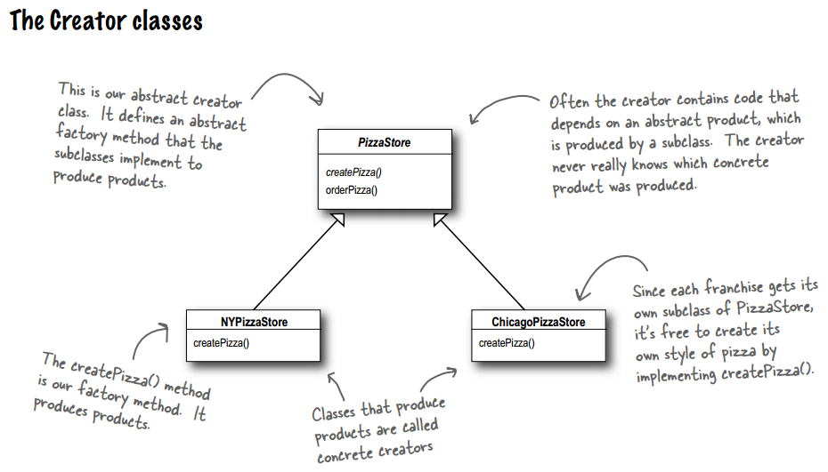  
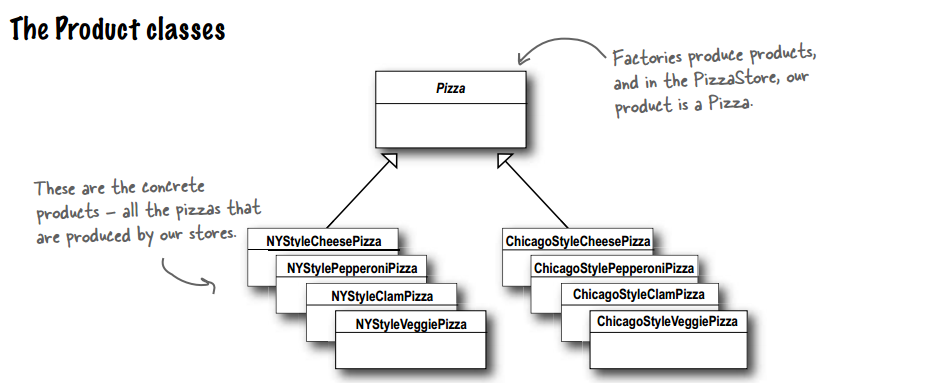  
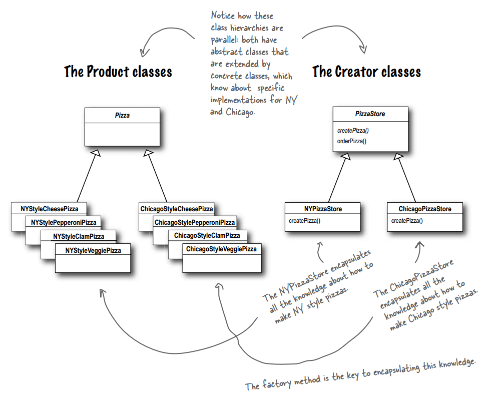  

- The Factory Method Pattern defines an interface for creating an object, but lets subclasses decide which class to instantiate. Factory Method lets a class defer instantiation to subclasses.

- factory pattern class diagram  
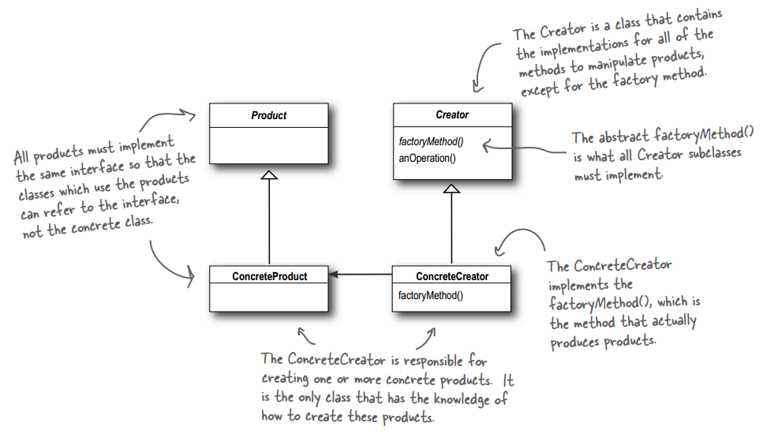  

- The subclasses do look a lot like Simple Factory, however think of Simple Factory as a one shot deal, while with Factory Method you are creating a framework that let’s the subclasses decide which implementation will be used.

- It should be pretty clear that reducing dependencies to concrete classes in our code is a “good thing.” In fact, we’ve got an OO design principle that formalizes this notion; it even has a big, formal name: Dependency Inversion Principle.

- design principle  
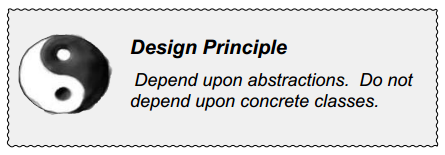  

- At first, this principle sounds a lot like “Program to an interface, not an implementation,” right? It is similar; however, the Dependency Inversion Principle makes an even stronger statement about abstraction. It suggests that our high-level components should not depend on our low-level components; rather, they should both depend on abstractions. A “high-level” component is a class with behavior defined in terms of other, “low level” components.

- object dependencies  
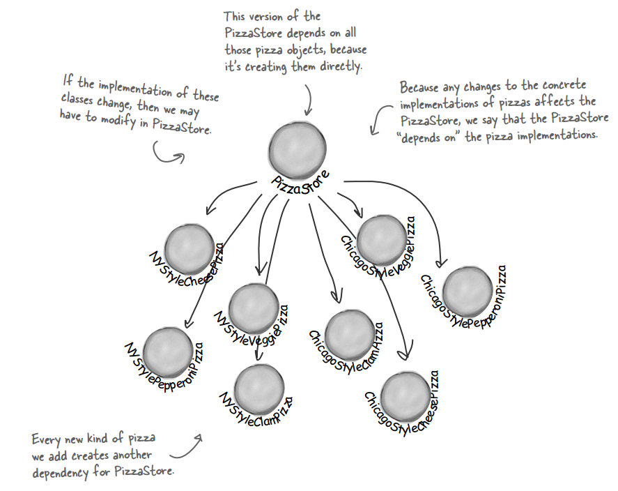  
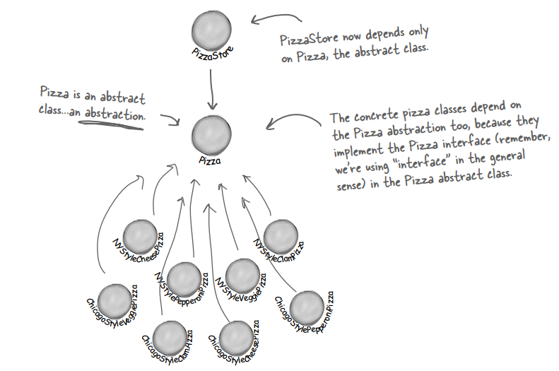  

- The following guidelines can help you avoid OO designs that violate the Dependency Inversion Principle:
	- No variable should hold a reference to a concrete class.
		- If you use new, you’ll be holding a reference to a concrete class. Use a factory to get around that!
	- No class should derive from a concrete class.
		- If you derive from a concrete class, you’re depending on a concrete class. Derive from an abstraction, like an interface or an abstract class.
	- No method should override an implemented method of any of its base classes.
		- If you override an implemented method, then your base class wasn’t really an abstraction to start with. Those methods implemented in the base class are meant to be shared by all your subclasses.

- The Abstract Factory Pattern provides an interface for creating families of related or dependent objects without specifying their concrete classes.

- abstract factory pattern class diagram  
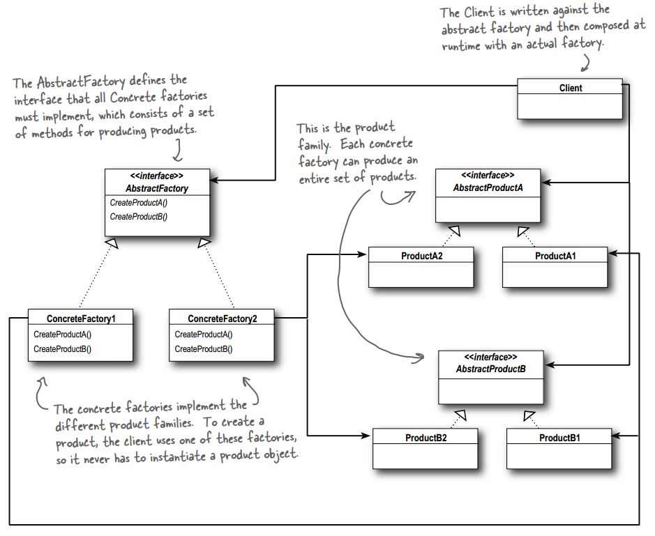  

- The job of an Abstract Factory is to define an interface for creating a set of products. Each method in that interface is responsible for creating a concrete product, and we implement a subclass of the Abstract Factory to supply those implementations. So, factory methods are a natural way to implement your product methods in your abstract factories.

- Factory Method and Abstract Factory compared  
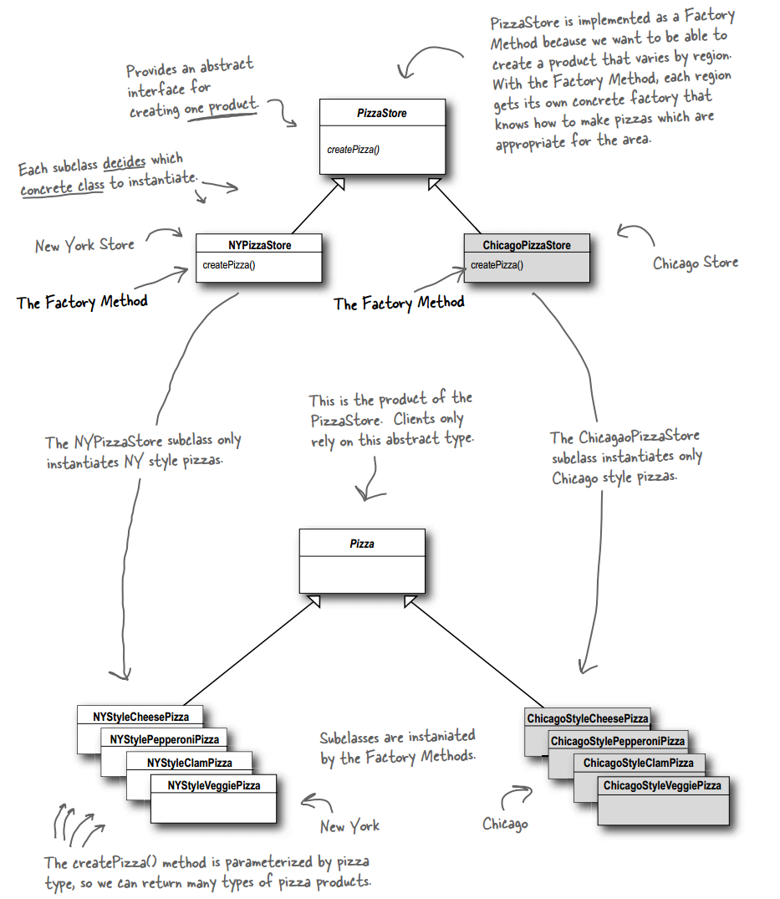  
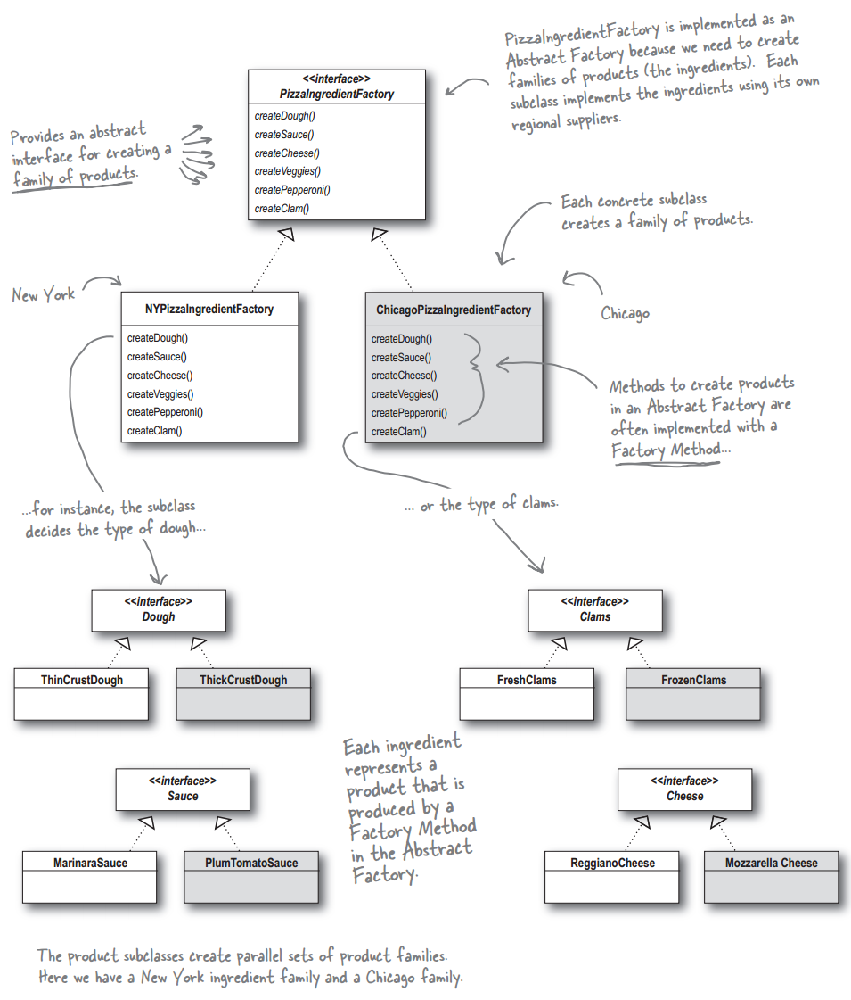  

- BULLET POINTS
	- All factories encapsulate object creation.
	- Simple Factory, while not a bona fide design pattern, is a simple way to decouple your clients from concrete classes.
	- Factory Method relies on inheritance: object creation is delegated to subclasses which implement the factory method to create objects.
	- Abstract Factory relies on object composition: object creation is implemented in methods exposed in the factory interface.
	- All factory patterns promote loose coupling by reducing the dependency of your application on concrete classes.
	- The intent of Factory Method is to allow a class to defer instantiation to its subclasses.
	- The intent of Abstract Factory is to create families of related objects without having to depend on their concrete classes.
	- The Dependency Inversion Principle guides us to avoid dependencies on concrete types and to strive for abstractions.
	- Factories are a powerful technique for coding to abstractions, not concrete classes.

#### &#x1F4DA; [Bookshelf](../)
#### &#x1F4DC; [Contents](./README.md#contents)
#### &#x1F448; [Prev](./Ch03_the_Decorator_Pattern.md)
#### &#x1F449; [Next](./Ch05_the_Singleton_Pattern.md)