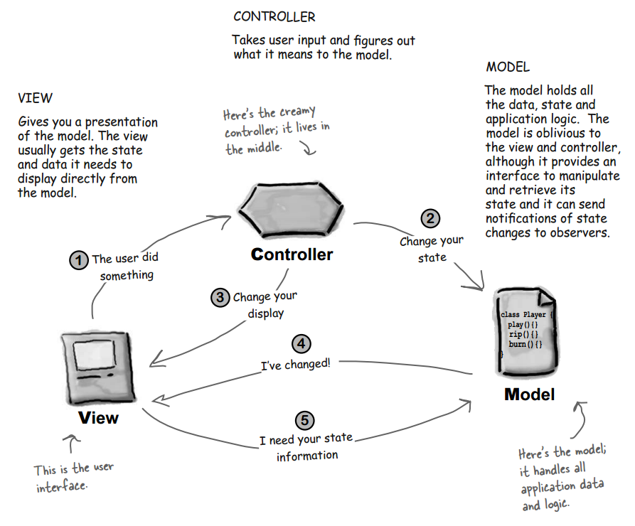
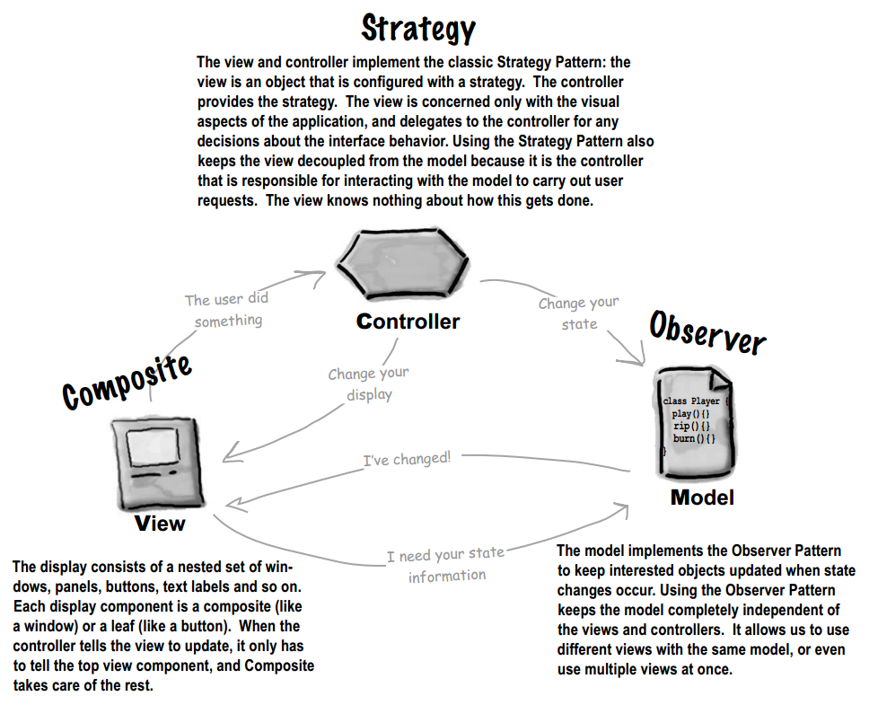
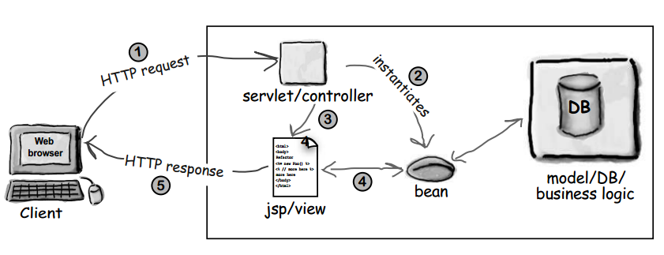
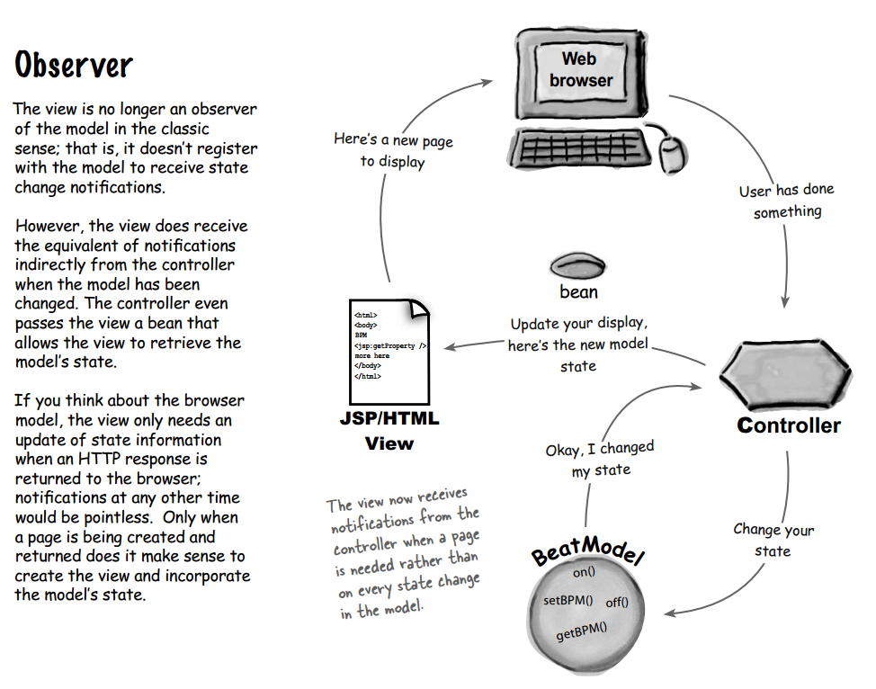
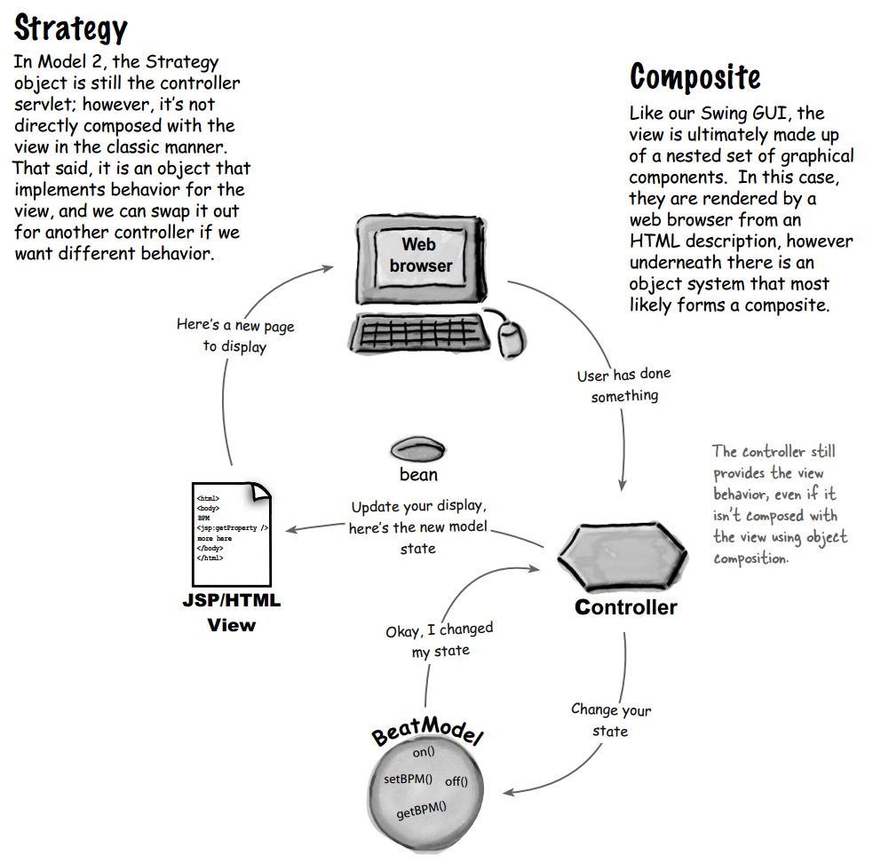

#### &#x1F4DA; [Bookshelf](../)
#### &#x1F4DC; [Contents](./README.md#contents)
#### &#x1F448; [Prev](./Ch11_the_Proxy_Pattern.md)
#### &#x1F449; [Next](./Ch13_Better_Living_with_Patterns.md)

## Chapter 12: Compound Patterns

- MVC  
  
  

- MVC and the Web  
  

- Model 2  
  
  

- The controller implements behavior for the view. It is the smarts that translates the actions from the view to actions on the model. The model takes those actions and implements the application logic to decide what to do in response to those actions. The controller might have to do a little work to determine what method calls to make on the model, but that’s not considered the “application logic.” The application logic is the code that manages and manipulates your data and it lives in your model.

- BULLET POINTS
	- The Model View Controller Pattern (MVC) is a compound pattern consisting of the Observer, Strategy and Composite patterns.
	- The model makes use of the Observer Pattern so that it can keep observers updated yet stay decoupled from them.
	- The controller is the strategy for the view. The view can use different implementations of the controller to get different behavior.
	- The view uses the Composite Pattern to implement the user interface, which usually consists of nested components like panels, frames and buttons.
	- These patterns work together to decouple the three players in the MVC model, which keeps designs clear and flexible.
	- The Adapter Pattern can be used to adapt a new model to an existing view and controller.
	- Model 2 is an adaptation of MVC for web applications.
	- In Model 2, the controller is implemented as a servlet and JSP & HTML implement the view.

#### &#x1F4DA; [Bookshelf](../)
#### &#x1F4DC; [Contents](./README.md#contents)
#### &#x1F448; [Prev](./Ch11_the_Proxy_Pattern.md)
#### &#x1F449; [Next](./Ch13_Better_Living_with_Patterns.md)