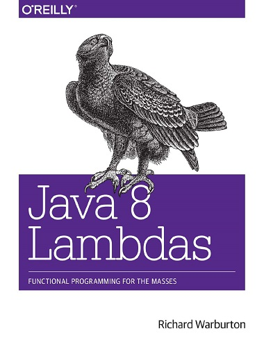

#### &#x1F4DA; [Back to Bookshelf](../)

  

## Introduction

If you’re a developer with core Java SE skills, this hands-on book takes you through the language changes in Java 8 triggered by the addition of lambda expressions. You’ll learn through code examples, exercises, and fluid explanations how these anonymous functions will help you write simple, clean, library-level code that solves business problems.

Lambda expressions are a fairly simple change to Java, and the first part of the book shows you how to use them properly. Later chapters show you how lambda functions help you improve performance with parallelism, write simpler concurrent code, and model your domain more accurately, including building better DSLs.
- Use exercises in each chapter to help you master lambda expressions in Java 8 quickly
- Explore streams, advanced collections, and other Java 8 library improvements
- Leverage multicore CPUs and improve performance with data parallelism
- Use techniques to “lambdify” your existing codebase or library code
- Learn practical solutions for lambda expression unit testing and debugging
- Implement SOLID principles of object-oriented programming with lambdas
- Write concurrent applications that efficiently perform message passing and non-blocking I/O

## Contents

[Chapter 01: Introduction](./Ch01_Introduction.md)

[Chapter 02: Lambda Expressions](./Ch02_Lambda_Expressions.md)

[Chapter 03: Streams](./Ch03_Streams.md)

[Chapter 04: Libraries](./Ch04_Libraries.md)

[Chapter 05: Advanced Collections and Collectors](./Ch05_Advanced_Collections_and_Collectors.md)

[Chapter 06: Data Parallelism](./Ch06_Data_Parallelism.md)

[Chapter 07: Testing, Debugging, and Refactoring](./Ch07_Testing_Debugging_and_Refactoring.md)

[Chapter 08: Design and Architectural Principles](./Ch08_Design_and_Architectural_Principles.md)

[Chapter 09: Lambda-Enabled Concurrency](./Ch09_Lambda_Enabled_Concurrency.md)

[Chapter 10: Moving Forward](./Ch10_Moving_Forward.md)

#### &#x1F4DA; [Back to Bookshelf](../)