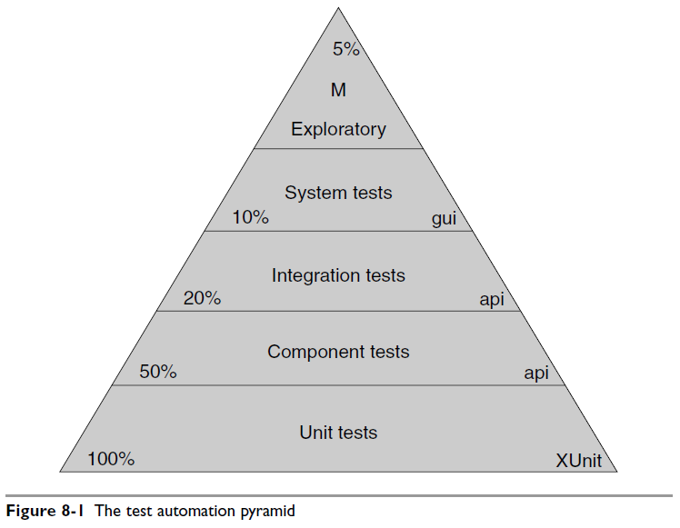
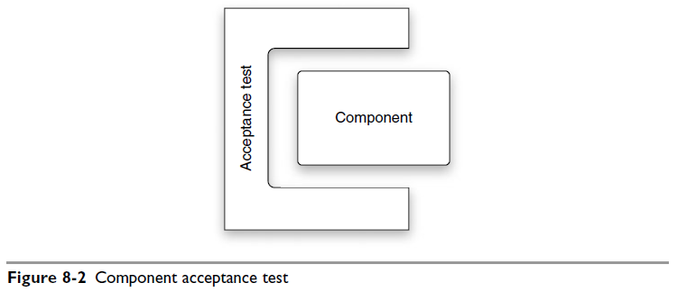
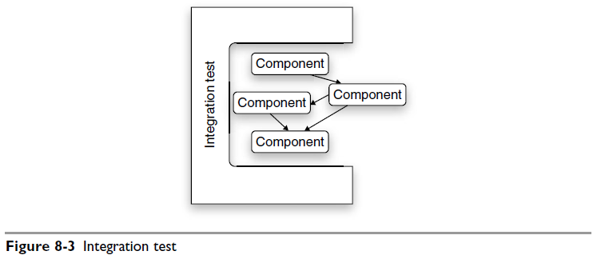

#### &#x1F4DA; [Bookshelf](../)
#### &#x1F4DC; [Contents](./README.md#contents)
#### &#x1F448; [Prev](./Ch07_Acceptance_Testing.md)
#### &#x1F449; [Next](./Ch09_Time_Management.md)

## Chapter 08: Testing Strategies

- The test automation pyramid  
  

- Component acceptance test  
  

- Integration test  
  

#### &#x1F4DA; [Bookshelf](../)
#### &#x1F4DC; [Contents](./README.md#contents)
#### &#x1F448; [Prev](./Ch07_Acceptance_Testing.md)
#### &#x1F449; [Next](./Ch09_Time_Management.md)