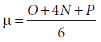
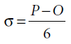

#### &#x1F4DA; [Bookshelf](../)
#### &#x1F4DC; [Contents](./README.md#contents)
#### &#x1F448; [Prev](./Ch09_Time_Management.md)
#### &#x1F449; [Next](./Ch11_Pressure.md)

## Chapter 10: Estimation

- In 1957, the Program Evaluation and Review Technique (PERT) was created to support the U.S. Navy’s Polaris submarine project. One of the elements of PERT is the way that estimates are calculated. The scheme provides a very simple, but very effective way to convert estimates into probability distributions suitable for managers.

	When you estimate a task, you provide three numbers. This is called trivariate analysis:

	- O: Optimistic Estimate.
	- N: Nominal Estimate.
	- P: Pessimistic Estimate.

	Given these three estimates, we can describe the probability distribution as follows:

	  
	  

- In the 1970s Barry Boehm introduced us to an estimation technique called “wideband delphi.” There have been many variations over the years. Some are formal, some are informal; but they all have one thing in common: consensus.

#### &#x1F4DA; [Bookshelf](../)
#### &#x1F4DC; [Contents](./README.md#contents)
#### &#x1F448; [Prev](./Ch09_Time_Management.md)
#### &#x1F449; [Next](./Ch11_Pressure.md)