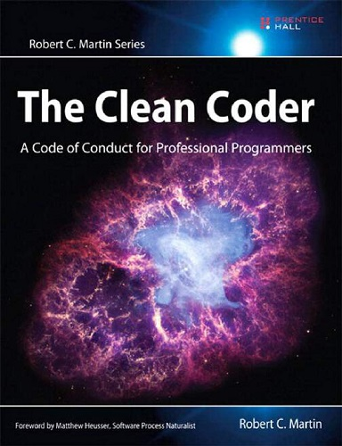

#### &#x1F4DA; [Back to Bookshelf](../)

  

## Introduction

Programmers who endure and succeed amidst swirling uncertainty and nonstop pressure share a common attribute: They care deeply about the practice of creating software. They treat it as a craft. They are professionals.

In **The Clean Coder: A Code of Conduct for Professional Programmers**, legendary software expert Robert C. Martin introduces the disciplines, techniques, tools, and practices of true software craftsmanship. This book is packed with practical advice–about everything from estimating and coding to refactoring and testing. It covers much more than technique: It is about attitude. Martin shows how to approach software development with honor, self-respect, and pride; work well and work clean; communicate and estimate faithfully; face difficult decisions with clarity and honesty; and understand that deep knowledge comes with a responsibility to act.

Readers will learn
- What it means to behave as a true software craftsman
- How to deal with conflict, tight schedules, and unreasonable managers
- How to get into the flow of coding, and get past writer’s block
- How to handle unrelenting pressure and avoid burnout
- How to combine enduring attitudes with new development paradigms
- How to manage your time, and avoid blind alleys, marshes, bogs, and swamps
- How to foster environments where programmers and teams can thrive
- When to say “No”–and how to say it
- When to say “Yes”–and what yes really means

Great software is something to marvel at: powerful, elegant, functional, a pleasure to work with as both a developer and as a user. Great software isn’t written by machines. It is written by professionals with an unshakable commitment to craftsmanship. The Clean Coder will help you become one of them–and earn the pride and fulfillment that they alone possess.

## Contents

[Chapter 01: Professionalism](./Ch01_Professionalism.md)

[Chapter 02: Saying No](./Ch02_Saying_No.md)

[Chapter 03: Saying Yes](./Ch03_Saying_Yes.md)

[Chapter 04: Coding](./Ch04_Coding.md)

[Chapter 05: Test Driven Development](./Ch05_Test_Driven_Development.md)

[Chapter 06: Practicing](./Ch06_Practicing.md)

[Chapter 07: Acceptance Testing](./Ch07_Acceptance_Testing.md)

[Chapter 08: Testing Strategies](./Ch08_Testing_Strategies.md)

[Chapter 09: Time Management](./Ch09_Time_Management.md)

[Chapter 10: Estimation](./Ch10_Estimation.md)

[Chapter 11: Pressure](./Ch11_Pressure.md)

[Chapter 12: Collaboration](./Ch12_Collaboration.md)

[Chapter 13: Teams and Projects](./Ch13_Teams_and_Projects.md)

[Chapter 14: Mentoring, Apprenticeship, and Craftsmanship](./Ch14_Mentoring_Apprenticeship_and_Craftsmanship.md)

#### &#x1F4DA; [Back to Bookshelf](../)