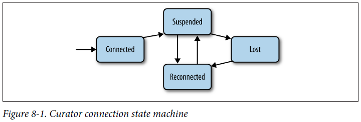

#### &#x1F4DA; [Bookshelf](../)
#### &#x1F4DC; [Contents](./README.md#contents)
#### &#x1F448; [Prev](./Ch07_The_C_Client.md)
#### &#x1F449; [Next](./Ch09_ZooKeeper_Internals.md)

## Chapter 08: Curator: A High-Level API for ZooKeeper

- At a high level, Curator is a set of libraries that build on top of ZooKeeper. One of the core goals of Curator is to manage the ZooKeeper handle for you, removing some (ideally all) of the complexity that connection management entails.

	As part of managing the handle, Curator implements a set of recipes that developers commonly use, incorporating best practices and known edge-case handling. For example, Curator implements recipes for primitives such as locks, barriers, and caches. For ZooKeeper operations like create, delete, getData, etc., it streamlines programming by allowing us to chain calls, a programming style often called fluent. It also provides namespaces, automatic reconnection, and other facilities that make applications more robust.

- A fluent API enables us to write code by chaining calls instead of relying upon a rigid signature scheme for invoking an operation. For example, with the standard ZooKeeper API, we create a znode synchronously by invoking something like:
  ```java
  zk.create("/mypath", new byte[0], ZooDefs.Ids.OPEN_ACL_UNSAFE, CreateMode.PERSISTENT);
  ```

	With the fluent API of Curator, we make the same call this way:
  ```java
  zkc.create().withMode(CreateMode.PERSISTENT).forPath("/mypath", new byte[0]);
  ```

	The create call returns a CreateBuilder instance and the subsequent calls return an object of a type that CreateBuilder extends.

	To execute the same operation asynchronously, we add inBackground as follows:
  ```java
  zkc.create().inBackground().withMode(CreateMode.PERSISTENT).forPath("/mypath", new byte[0]);
  ```

	To set a watch, we simply add watched to the call chain. For example:
  ```java
  zkc.getData().inBackground().watched().forPath("/mypath");
  ```

- Let’s have a look at how to implement a listener that processes all callbacks and watch notifications for our master Curator example. The first step is to implement the template for a CuratorListener:
  ```java
  CuratorListener masterListener = new CuratorListener() {
    public void eventReceived(CuratorFramework client, CuratorEvent event) {
      try {
        switch (event.getType()) {
        case CHILDREN:
          ...
          break;
        case CREATE:
          ...
          break;
        case DELETE:
          ...
          break;
        case WATCHED:
          ...
          break;
        }
      } catch (Exception e) {
        LOG.error("Exception while processing event.", e);
        try {
          close();
        } catch (IOException ioe) {
          LOG.error("IOException while closing.", ioe);
        }
      }
    }
  };
  ```

	We next need to register the listener. For this we need a framework client, which we can create just like the first client we created:
  ```java
  client = CuratorFrameworkFactory.newClient(hostPort, retryPolicy);
  ```

	Once we have the framework client, we register the listener as follows:
  ```java
  client.getCuratorListenable().addListener(masterListener);
  ```

	A special kind of listener deals with errors reported when a background thread catches an exception. This is a low-level detail, but it might be necessary if you want to handle them in your application. When the application needs to deal with such errors, it must implement a different kind of listener:
  ```java
  UnhandledErrorListener errorsListener = new UnhandledErrorListener() {
    public void unhandledError(String message, Throwable e) {
      LOG.error("Unrecoverable error: " + message, e);
      try {
        close();
      } catch (IOException ioe) {
        LOG.warn( "Exception when closing.", ioe );
      }
    }
  };
  ```

	and register it with the listener client as follows:
  ```java
  client.getUnhandledErrorListenable().addListener(errorsListener);
  ```

- Curator connection state machine  


#### &#x1F4DA; [Bookshelf](../)
#### &#x1F4DC; [Contents](./README.md#contents)
#### &#x1F448; [Prev](./Ch07_The_C_Client.md)
#### &#x1F449; [Next](./Ch09_ZooKeeper_Internals.md)