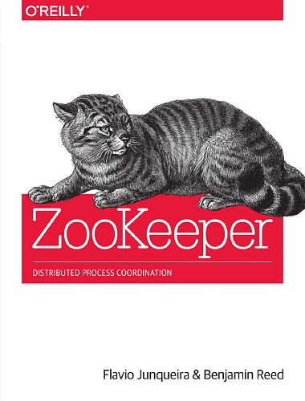

#### &#x1F4DA; [Back to Bookshelf](../)

  

## Introduction

Building distributed applications is difficult enough without having to coordinate the actions that make them work. This practical guide shows how Apache ZooKeeper helps you manage distributed systems, so you can focus mainly on application logic. Even with ZooKeeper, implementing coordination tasks is not trivial, but this book provides good practices to give you a head start, and points out caveats that developers and administrators alike need to watch for along the way.

In three separate sections, ZooKeeper contributors Flavio Junqueira and Benjamin Reed introduce the principles of distributed systems, provide ZooKeeper programming techniques, and include the information you need to administer this service.
- Learn how ZooKeeper solves common coordination tasks
- Explore the ZooKeeper API’s Java and C implementations and how they differ
- Use methods to track and react to ZooKeeper state changes
- Handle failures of the network, application processes, and ZooKeeper itself
- Learn about ZooKeeper’s trickier aspects dealing with concurrency, ordering, and configuration
- Use the Curator high-level interface for connection management
- Become familiar with ZooKeeper internals and administration tools

## Contents

[Chapter 01: Introduction](./Ch01_Introduction.md)

[Chapter 02: Getting to Grips with ZooKeeper](./Ch02_Getting_to_Grips_with_ZooKeeper.md)

[Chapter 03: Getting Started with the ZooKeeper API](./Ch03_Getting_Started_with_the_ZooKeeper_API.md)

[Chapter 04: Dealing with State Change](./Ch04_Dealing_with_State_Change.md)

[Chapter 05: Dealing with Failure](./Ch05_Dealing_with_Failure.md)

[Chapter 06: ZooKeeper Caveat Emptor](./Ch06_ZooKeeper_Caveat_Emptor.md)

[Chapter 07: The C Client](./Ch07_The_C_Client.md)

[Chapter 08: Curator: A High-Level API for ZooKeeper](./Ch08_Curator_A_High_Level_API_for_ZooKeeper.md)

[Chapter 09: ZooKeeper Internals](./Ch09_ZooKeeper_Internals.md)

[Chapter 10: Running ZooKeeper](./Ch10_Running_ZooKeeper.md)

#### &#x1F4DA; [Back to Bookshelf](../)